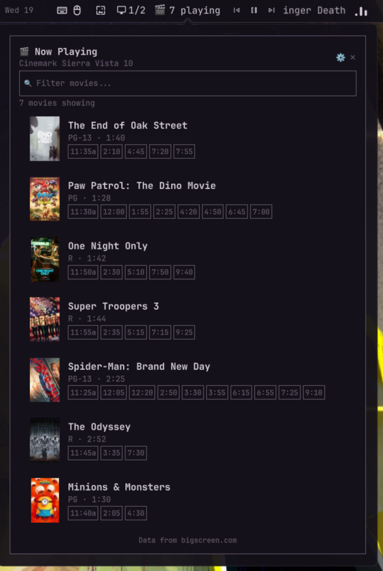

# Now Playing



A Quickshell plugin that shows movies currently playing at your local theater, with poster art, MPAA ratings, and showtimes. Click any movie to buy tickets on Fandango.

## Features

- Bar pill showing movie count and theater name
- Popup panel with poster thumbnails, MPAA ratings, runtime, and showtimes
- Filter movies by title
- Search theaters by ZIP code — saves your selection
- Click a movie to open it on BigScreen.com
- Auto-refreshes every 12 hours

## Install

```bash
omarchy plugin add https://github.com/Deoxizn/now-playing --enable
```

## Uninstall

```bash
omarchy plugin remove com.user.now-playing
```

Removes the plugin and bar widget. Cached data is left in `~/.cache/now-playing/` — delete manually if desired.

## Configuration

Selected theater is saved to `~/.config/now-playing/config.json`. Cache is stored in `~/.cache/now-playing/data.json`.

## Requirements

- Omarchy Linux with Quattro+ (Shibumi or default bar)
- `curl` (for fetching showtime data)

## Data Source

Movie data is scraped from [BigScreen.com](https://www.bigscreen.com). No API key required.
